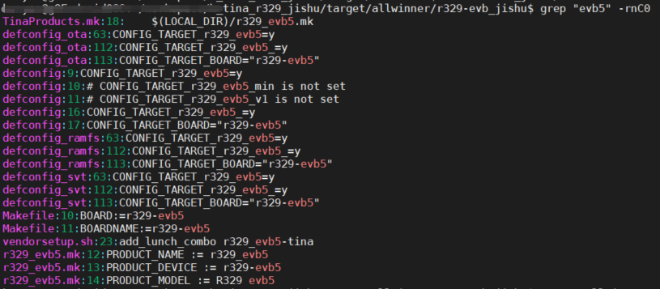

# 新建一个方案

基于一个已有的参考方案，复制一份配置文件。比如参考*r329_evb5*做一份名为*r329_evb5_jishu*的方案

```bash
cd device/config/chips/r329/configs
cp -rf evb5 evb5_jishu
```


```bash
cd target/allwinner/r329-evb5
cp -rf r329-evb5 r329-evb5_jishu
```


找到这个配置中所有包含*r329_evb5*的项，并将其改为*r329_evb5_jishu*

```bash
kunyao@xxxxx:~/workspace/h_tina_r329_jishu/target/allwinner/r329-evb_jishu$ grep "evb5" -rnC0
TinaProducts.mk:18:    $(LOCAL_DIR)/r329_evb5.mk
defconfig_ota:63:CONFIG_TARGET_r329_evb5=y
defconfig_ota:112:CONFIG_TARGET_r329_evb5_=y
defconfig_ota:113:CONFIG_TARGET_BOARD="r329-evb5"
defconfig:9:CONFIG_TARGET_r329_evb5=y
defconfig:10:# CONFIG_TARGET_r329_evb5_min is not set
defconfig:11:# CONFIG_TARGET_r329_evb5_v1 is not set
defconfig:16:CONFIG_TARGET_r329_evb5_=y
defconfig:17:CONFIG_TARGET_BOARD="r329-evb5"
defconfig_ramfs:63:CONFIG_TARGET_r329_evb5=y
defconfig_ramfs:112:CONFIG_TARGET_r329_evb5_=y
defconfig_ramfs:113:CONFIG_TARGET_BOARD="r329-evb5"
defconfig_svt:63:CONFIG_TARGET_r329_evb5=y
defconfig_svt:112:CONFIG_TARGET_r329_evb5_=y
defconfig_svt:113:CONFIG_TARGET_BOARD="r329-evb5"
Makefile:10:BOARD:=r329-evb5
Makefile:11:BOARDNAME:=r329-evb5
vendorsetup.sh:23:add_lunch_combo r329_evb5-tina
r329_evb5.mk:12:PRODUCT_NAME := r329_evb5
r329_evb5.mk:13:PRODUCT_DEVICE := r329-evb5
r329_evb5.mk:14:PRODUCT_MODEL := R329 evb5
```

