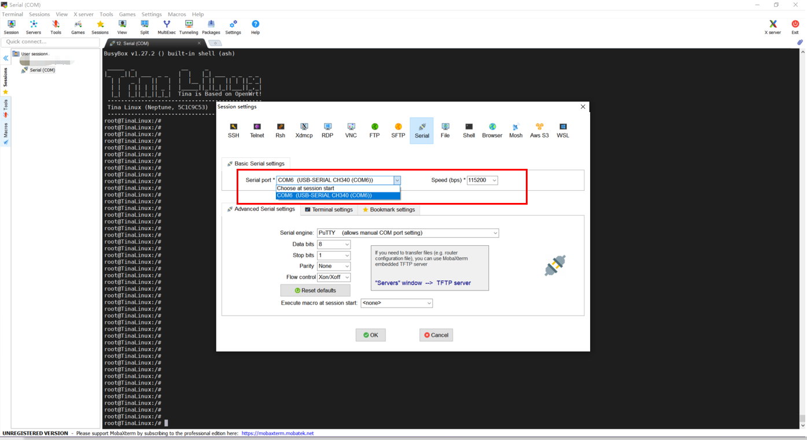

# 上手第一步：连接上位机查看终端

R329 EVB5开发板在出厂时已经烧写了系统固件，支持Linux4.9内核的Tina Linux系统，您可以直接用于调试。  
R329 EVB5提供了两种设备调试的方法，分别是**串口**和**ADB**。  
首先，您需要配置电脑端的调试工具，串口及ADB的电脑配置方法见：[开发工具](https://r329.docs.allwinnertech.com/zh_CN/latest/getsource/getdevtools/)  


## 串口连接

### 设备上电并连接电脑

插上电源，串口线连接开发板和电脑USB，如图：


*图中右上角的屏幕为左下角笔记本的HDMI拓展

串口线线序如图：


### 安装串口驱动

插入USB串口线后Windos系统会提示安装驱动，部分型号的串口线会自动搜索驱动安装，但有些型号的串口线驱动会搜索不到安装失败，随盒提供的串口线为CH341SER，驱动下载：[CH341SER串口线驱动](http://netstorage.allwinnertech.com:5000/sharing/dsn8IbX8s)


### 打开串口软件

打开串口软件**MobaXterm**，点击左上角的**Session-Serial**，如果此时串口USB线已经插入，会在Serial port里显示识别到的串口**CMO5 (USB-SERIAL CH340(COM5)**，选择该串口并将波特率设置为**115200**，点击确定，即会打开一个串口终端。



*您也可以根据自己的喜好选择喜欢串口软件，如Putty、Ubuntu的Minicom等

### 输入第一条命令

在终端输入第一条命令 

```bash
ls
```

此时可以看到根目录下的路径及文件：
```bash
root@TinaLinux:/# ls
44100-mono-s16_le-10s.wav  rdinit
base                       rom
bin                        root
dev                        sbin
etc                        sys
lib                        test.wav
lib64                      tmp
mnt                        usr
overlay                    var
proc                       www
```


**如果看到这些，那么恭喜你，你已经拥有了操控了这个开发板的能力，现在，开始驾驭它在嵌入式的世界里遨游吧！**


## ADB连接

ADB全称Android debug bridge，顾名思义，即连接安卓的桥梁，原来是通过USB连接PC和Android设备的调试工具，现也被移植到全志Tina Linux系统上，会在系统启动时自动在后台运行，当电脑连接开发板时，即可和开发板进行通信。

相比串口，ADB有更高的传输速率，除了终端命令控制，还可以通过ADB往开发板里推拉文件。同时，全志提供的一些生产测试工具，如DragonMAT等，也是通过ADB和开发板进行通信的。


### 安装和使用方法
将adb.exe文件放到任意目录下，建议是比较浅的路径，如D:\adb.exe，然后将该路径添加到系统环境变量中，即可在cmd下直接进行adb操作。详细方法和高阶操作在互联上有大量介绍，可自行搜索学习。

启动路径：Windows系统开始-cmd-命令行终端-ADB


### 示例

把test.wav文件电脑推到开发板的根目录下：

```bas
C:\Users\kunyao>adb push test.wav ./.
test.wav: 1 file pushed. 1.6 MB/s (35884 bytes in 0.022s)
```

再把开发板里的test.wav文件拉回来：

```bash
C:\Users\kunyao>adb pull ./test.wav ./.
./test.wav: 1 file pulled. 1.4 MB/s (35884 bytes in 0.024s)
```

