# 上手第二步：控制开发板

等成功用串口或者ADB连接开发板之后，就可以通过终端命令对开发板进行控制了。

下面介绍Tina Linux系统封装几个模块，您可以通过命令启动这几个模块的demo，操控终端几个模块的软硬件。

## 点灯

R329支持LEDC，LEDC全称 **“Light Emitting Diode Controller”**，是借助Linux LED标准子系统实现的LED控制模块，可以对LED灯进行点亮、亮度调节、闪烁、阵列控制等操作。LEDC模块在无屏幕智能音箱上用得很多，比如在等待配对、唤醒、音乐播放等场景，LED灯会以不同的效果表示当前状态。

内置固件已经编译好了LEDC模块，可以直接对LED节点进行控制从而点亮LED灯。

### 进入LED灯路径

首先，我们可以进入LED节点的位置查看一个LED灯三个颜色的节点（R G B）：

```bash
root@TinaLinux:/# cd /sys/class/leds/
root@TinaLinux:/sys/class/leds# ls
sunxi_led0b  sunxi_led0g  sunxi_led0r
```

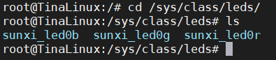

### 查看LED灯的配置

三个节点分别代三个颜色，我们可以进入一个颜色节点，比如红色（R）：

```bash
root@TinaLinux:/sys/class/leds# cd sunxi_led0r/
root@TinaLinux:/sys/devices/platform/soc/ledc/leds/sunxi_led0r# ls
brightness      device          subsystem
delay_off       max_brightness  trigger
delay_on        power           uevent
```

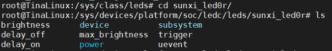

可以看到LEDC已经做好了很多LEDC的基本操作，包括亮度调节、闪烁、延时等。

### 点亮一个灯

如果我们要点亮其中一个颜色，可以把亮度值写到 **brightness** 里，亮度值最高为255：

```bash
root@TinaLinux:/sys/devices/platform/soc/ledc/leds/sunxi_led0r# echo 255 > brightness
```

此时LED灯会被点亮

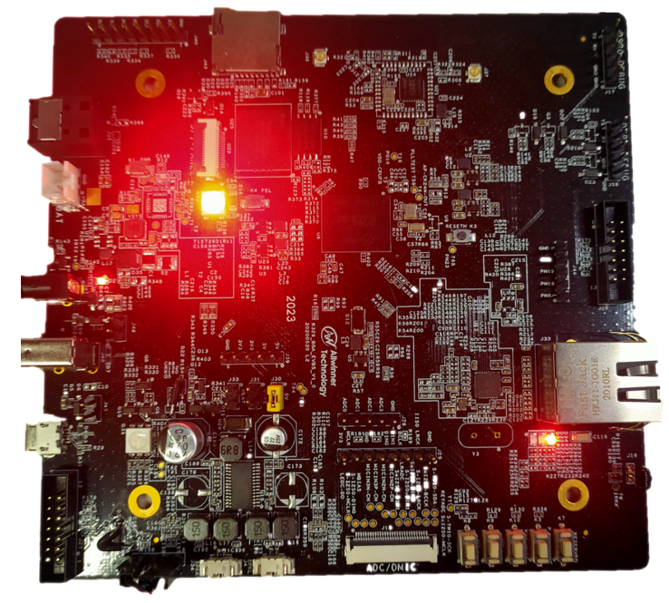

### 调节亮度

如果要调节亮度值的话，只需调节写到 **brightness** 的值即可，亮度值范围为0~255，0代表熄灭，255代表最亮：

```bash
root@TinaLinux:/sys/devices/platform/soc/ledc/leds/sunxi_led0r# echo 255 > brightness
root@TinaLinux:/sys/devices/platform/soc/ledc/leds/sunxi_led0r# echo 100 > brightness
root@TinaLinux:/sys/devices/platform/soc/ledc/leds/sunxi_led0r# echo 10 > brightness
root@TinaLinux:/sys/devices/platform/soc/ledc/leds/sunxi_led0r# echo 0 > brightness
```

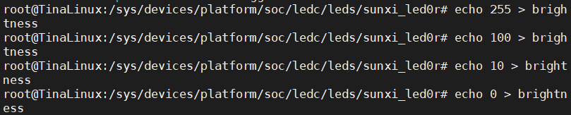

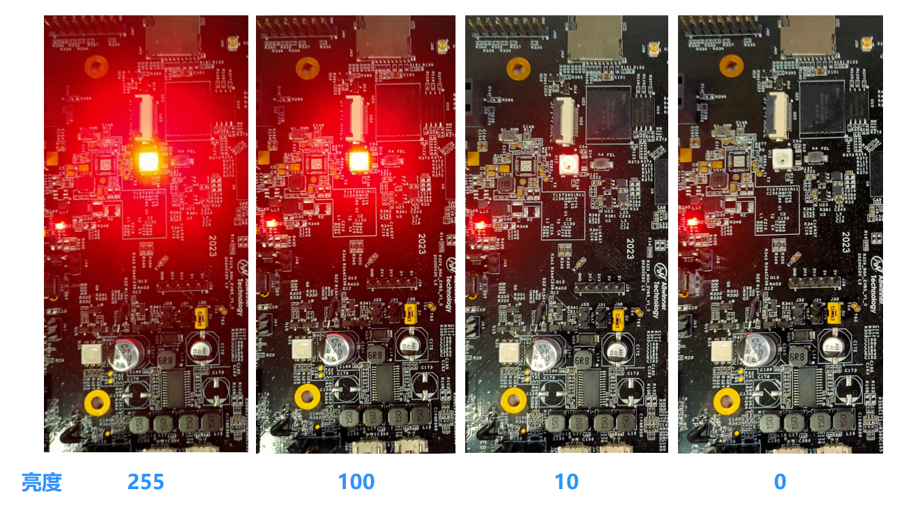

### 点亮其它颜色的灯

如果要点亮其它颜色的灯 ，只需要参照红灯，将亮度值写到绿灯和蓝灯的 **brightness ** 里即可：

````bash
root@TinaLinux:/sys/class/leds# echo 255 > sunxi_led0g/brightness
root@TinaLinux:/sys/class/leds# echo 0 > sunxi_led0g/brightness
root@TinaLinux:/sys/class/leds# echo 255 > sunxi_led0b/brightness
root@TinaLinux:/sys/class/leds# echo 0 > sunxi_led0b/brightness
````


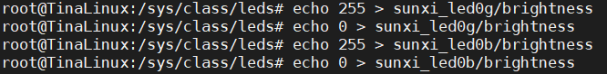

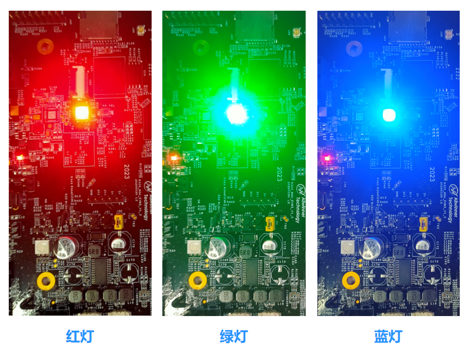

### 闪烁

如果要实现LED灯闪烁的效果，把 **timer** 写到 **trigger** 即可：

```bash
root@TinaLinux:/sys/class/leds# echo timer > sunxi_led0r/trigger
```


LED灯阵列操作、模块配置、源码结构、内外部接口等进阶操作请见开发文档《Tina Linux LED开发指南》：[《Tina Linux LED开发指南》下载](http://netstorage.allwinnertech.com:5000/sharing/NMoYOnCrI)

同时，还可以使用三个PWM接口对LED的三色灯进行控制，但需要占用较多的引脚和资源。


**如果你看到灯亮了，那么恭喜你，它将照亮你嵌入式开发学习的路。**


## wifi连网

R329 EVB5开发板上集成了全志自研的XR829无线芯片，支持2.4G wifi 和BT功能。Tina Linux系统对无线功能进行集成，可以直接使用内置DEMO连接wiff、BT。这里主要演示wifi demo 。

首先需要确保开发板上贴上了天线，否则会因为信号强度过弱连接失败。R329 EVB5开发板标准装中随盒附赠了一根天线。

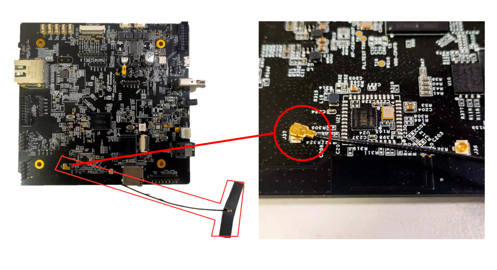

### WiFi 命令

在终端输入命令行 **wifi** 然后按 **TAB键** 补全，会看到系统下内置了大量wifi相关的命令，包括打开、关闭、扫描、连接、中文连接、移除等。

```bash
root@TinaLinux:/# wifi_
wifi_connect_ap_test             wifi_off_test
wifi_connect_ap_with_netid_test  wifi_on_off_test
wifi_connect_chinese_ap_test     wifi_on_test
wifi_disconnect_ap_test          wifi_reconnect_ap_test
wifi_get_connection_info_test    wifi_remove_all_networks_test
wifi_get_netid_test              wifi_remove_network_test
wifi_list_networks_test          wifi_scan.sh
wifi_longtime_scan_test          wifi_scan_results_test
wifi_longtime_test               wifi_wps_pbc_test
```

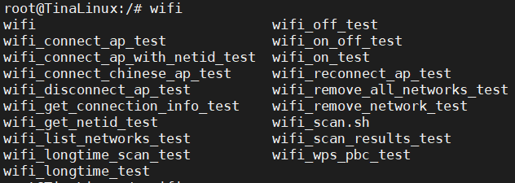

### 搜索附近WiFi

输入 **wifi_scan_results_test** ，即可搜索到附近的wifi信号，会显示bssid、频率、信号强度、加密方式和SSID等信息：

```bas
root@TinaLinux:/# wifi_scan_results_test

*********************************
***Start scan!***
*********************************
bssid / frequency / signal level / flags / ssid
7e:b5:9b:1d:e1:bd       2437    -52     [WPA2-PSK-CCMP][ESS]    AWTest
7c:b5:9b:fd:e1:bd       2437    -54     [WPA-EAP-CCMP+TKIP][WPA2-EAP-CCMP+TKIP][ESS]    AWOffice
88:d7:f6:88:8b:c0       2412    -40     [WPA2-PSK-CCMP][WPS][ESS]       AW-PDC-PD4-316Test
90:67:1c:f8:11:ac       2437    -44     [WPA-PSK-CCMP+TKIP][WPA2-PSK-CCMP+TKIP][WPS][ESS]       AW-PDC-RTOS-MUSIC
36:a1:d4:cd:10:72       2417    -53     [WPA2-PSK-CCMP][ESS]    Mi 10 Pro_zxnn\xe2\x80\x8b
c4:f0:81:63:9d:30       2462    -57     [WPA2-PSK-CCMP][WPS][ESS]       AW-PTD-H-test
00:6b:8e:4e:c0:08       2462    -58     [WPA-PSK-CCMP][WPA2-PSK-CCMP][ESS]      AW-PDC-PD4-315test
c4:f0:81:63:9d:31       2462    -58     [WPA2-PSK-CCMP][ESS]    \x00\x00\x00\x00\x00\x00\x00\x00\x00\x00\x00\x00\x00\x00\x00\x00\x00\x00\x00\x00\x00\x00\x00\x00\x00\x00\x00\x00\x00\x00\x00\x00
ec:6c:9f:af:89:79       2447    -61     [WPA2-PSK-CCMP][ESS]    AW-APD-GMSipv6
c8:4c:75:40:86:ff       2452    -62     [WPA-EAP-CCMP+TKIP][WPA2-EAP-CCMP+TKIP-preauth][ESS]    Allwinner
08:10:79:a4:78:84       2417    -67     [WPA-PSK-CCMP+TKIP][WPA2-PSK-CCMP+TKIP][ESS]    AW-PD4-NETTEST
64:6e:97:5b:14:42       2462    -67     [WPA-EAP-CCMP+TKIP][WPA2-EAP-CCMP+TKIP][ESS]    AWOffice
7c:b5:9b:fd:e1:63       2412    -68     [WPA-EAP-CCMP+TKIP][WPA2-EAP-CCMP+TKIP][ESS]    AWOffice
7e:b5:9b:1d:e1:63       2412    -68     [WPA2-PSK-CCMP][ESS]    AWTest
7e:b5:9b:2d:e1:63       2412    -68     [WPA-PSK-CCMP+TKIP][WPA2-PSK-CCMP+TKIP][ESS]    AW-IT-Test
66:6e:97:1b:14:42       2462    -69     [WPA-PSK-CCMP+TKIP][WPA2-PSK-CCMP+TKIP][ESS]    AWTest
64:6e:97:5a:5a:e4       2462    -70     [WPA-EAP-CCMP+TKIP][WPA2-EAP-CCMP+TKIP][ESS]    AWOffice
38:1c:1a:2e:b3:51       2437    -66     [WPA-EAP-CCMP][WPA2-EAP-CCMP][ESS]      AWOffice
66:6e:97:1a:5a:e4       2462    -71     [WPA2-PSK-CCMP][ESS]    AWTest
ba:8c:21:2e:d1:6c       2412    -73     [WPA-PSK-CCMP][WPA2-PSK-CCMP][ESS]      AW-ANC-TPLINK_D16B#170
74:a5:28:9a:fc:d4       2452    -69     [WPA-PSK-CCMP+TKIP][WPA2-PSK-CCMP+TKIP][WPS][ESS]       AW-PTD-HK
80:e8:6f:d9:5d:61       2412    -76     [WPA-EAP-CCMP][WPA2-EAP-CCMP][ESS]      AWOffice
80:e8:6f:d9:5d:62       2412    -76     [WPA2-PSK-CCMP][ESS]    AWTest
ac:07:5f:7d:c3:b9       2412    -79     [WPA2-PSK-CCMP][ESS]    \x00\x00\x00\x00\x00\x00\x00\x00
******************************
Wifi get_scan_results: Success!
******************************

```

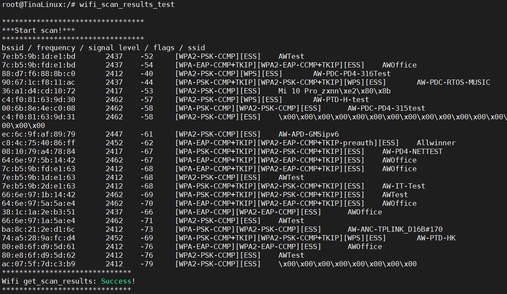

### 连接一个wifi 

输入wifi_connect_ap_test +wifi ssid（wifi名）+密码，即可连接该wifi ，如连接ssid为*AWTest* 、密码为 *12345678* 的wifi：

```bash
root@TinaLinux:/# wifi_connect_ap_test AWTest 12345678
==================================
Connecting to the network(AWTest)......
[  196.862383] [STA_WRN] Freq 2437 (wsm ch: 6) prev: 3.
[  196.867990] wlan0: authenticate with 7e:b5:9b:1d:e1:bd (try 1)
[  196.875266] [STA_WRN] [HT40][xradio_join_work][bss_ht_info]:
[  196.875266] [primary_chan  :0x00000006]
[  196.875266] [ht_param      :0x00000007]
[  196.875266] [operation_mode:0x00000000]
[  196.875266] [stbc_param    :0x00000000]
[  196.875266] [basic_set[0]  :0x00000000]
[  196.903079] [STA_WRN] [HT40][xradio_join_work][PhyModeCfg:0x0027]
[  196.903079] [ModemFlags    :0x00000007]
[  196.903079] [ChWidthCfg    :0x00000002]
[  196.903079] [PriChCfg      :0x00000000]
[  196.903079] [BandCfg       :0x00000000]
[  196.903079] [STBC_Enable   :0x00000000]
[  196.903079] [PreambleCfg   :0x00000000]
[  196.903079] [SGI_Enable    :0x00000000]
[  196.903079] GF_Enable      :0x00000000]
[  196.984781] wlan0: authenticated
[  196.988606] [STA_WRN] Freq 2422 (wsm ch: 3) prev: 6.
[  196.994393] [STA_WRN] Freq 2437 (wsm ch: 6) prev: 3.
[  196.999993] wlan0: associate with 7e:b5:9b:1d:e1:bd (try 1)
[  197.021251] wlan0: RX AssocResp from 7e:b5:9b:1d:e1:bd (capab=0x1411 status=0 aid=2)
[  197.029988] wlan0: associated
[  197.038283] [AP_WRN] [STA] ASSOC HTCAP 11N 58
[  197.043207] [AP_WRN] [HT40][xradio_bss_info_changed][ht_prot:0x00000002][HtProtMode:0x0000][Green:0x0004]
[  197.053998] [AP_WRN] [HT40][xradio_bss_info_changed][PhyModeCfg:0x4027]
[  197.053998] [ModemFlags    :0x00000007]
[  197.053998] [ChWidthCfg    :0x00000002]
[  197.053998] [PriChCfg      :0x00000000]
[  197.053998] [BandCfg       :0x00000000]
[  197.053998] [STBC_Enable   :0x00000000]
[  197.053998] [PreambleCfg   :0x00000000]
[  197.053998] [SGI_Enable    :0x00000001]
[  197.053998] [GF_Enable     :0x00000000]
[  197.143876] IPv6: ADDRCONF(NETDEV_CHANGE): wlan0: link becomes ready
Connected to the AP(AWTest)
Getting ip address(AWTest)......
[  199.128130] [TXRX_WRN] drop=1759, fctl=0x00d0.
Wifi connect ap : Success!
==================================
root@TinaLinux:/# [  199.845392] [TXRX_WRN] drop=1759, fctl=0x00d0.
```

如果显示 **Wifi connect ap : Success!** 即为连接成功了。

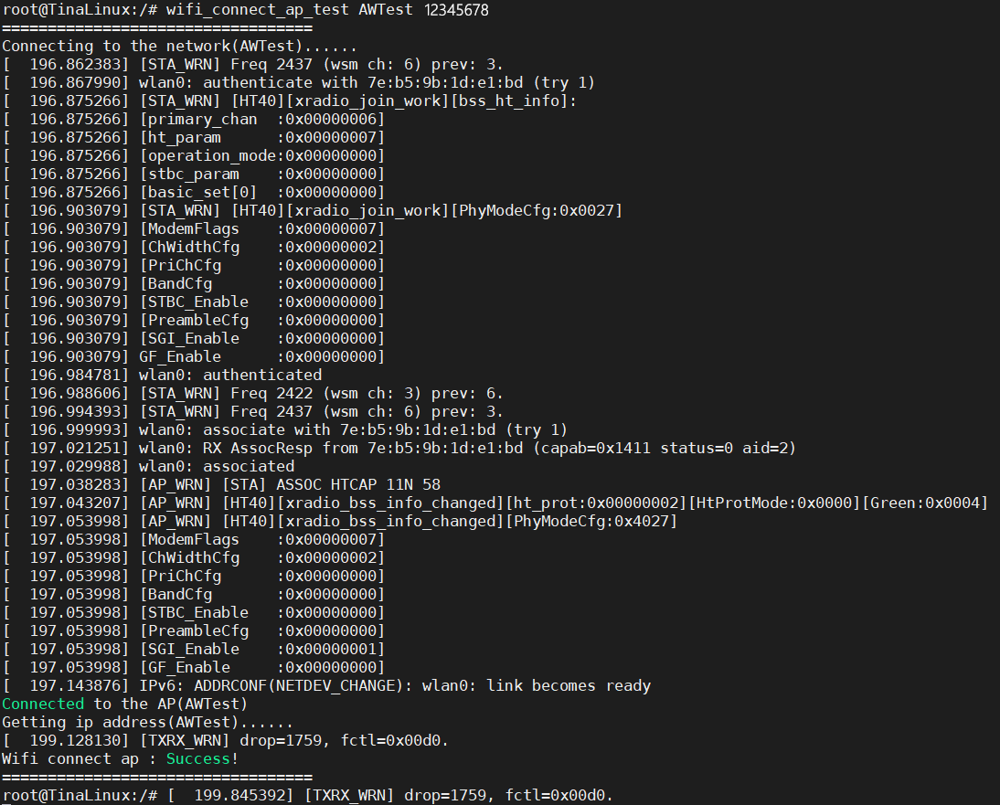


 ### Ping通一个网站

Tina系统已经将协议层等相关配置都配置好，可以直接ping通互联网上的网址，如ping百度：

```bash
root@TinaLinux:/# ping baidu.com
PING baidu.com (220.181.38.148): 56 data bytes
64 bytes from 220.181.38.148: seq=0 ttl=52 time=50.064 ms
64 bytes from 220.181.38.148: seq=1 ttl=52 time=45.933 ms
64 bytes from 220.181.38.148: seq=2 ttl=52 time=50.558 ms
64 bytes from 220.181.38.148: seq=3 ttl=52 time=61.543 ms
64 bytes from 220.181.38.148: seq=4 ttl=52 time=65.560 ms
64 bytes from 220.181.38.148: seq=6 ttl=52 time=167.182 ms
64 bytes from 220.181.38.148: seq=7 ttl=52 time=59.301 ms
64 bytes from 220.181.38.148: seq=8 ttl=52 time=54.295 ms
^C
--- baidu.com ping statistics ---
10 packets transmitted, 8 packets received, 20% packet loss
round-trip min/avg/max = 45.933/69.304/167.182 ms
```


**如果看到这些打印，那么恭喜你，你已经拥有了使用开发板和世界握手的能力！**

**Across the Great Wall we can reach every corner in the world！**


## 录音和播放