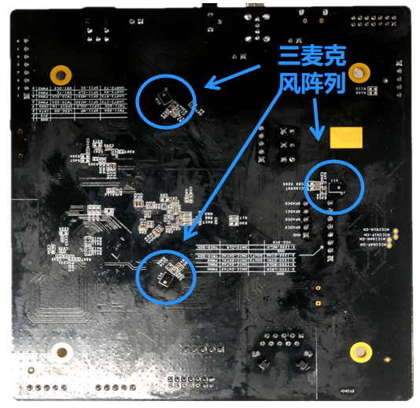
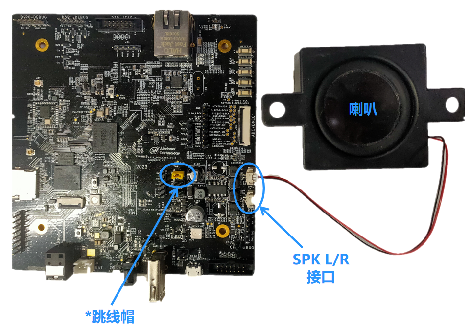
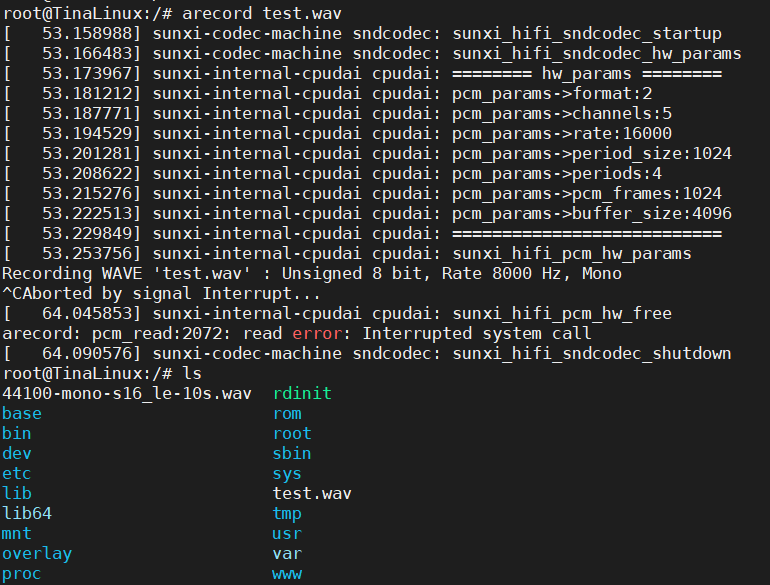
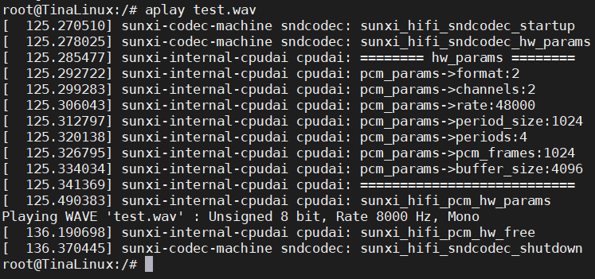
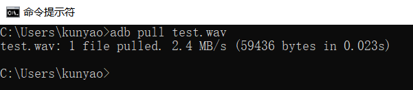
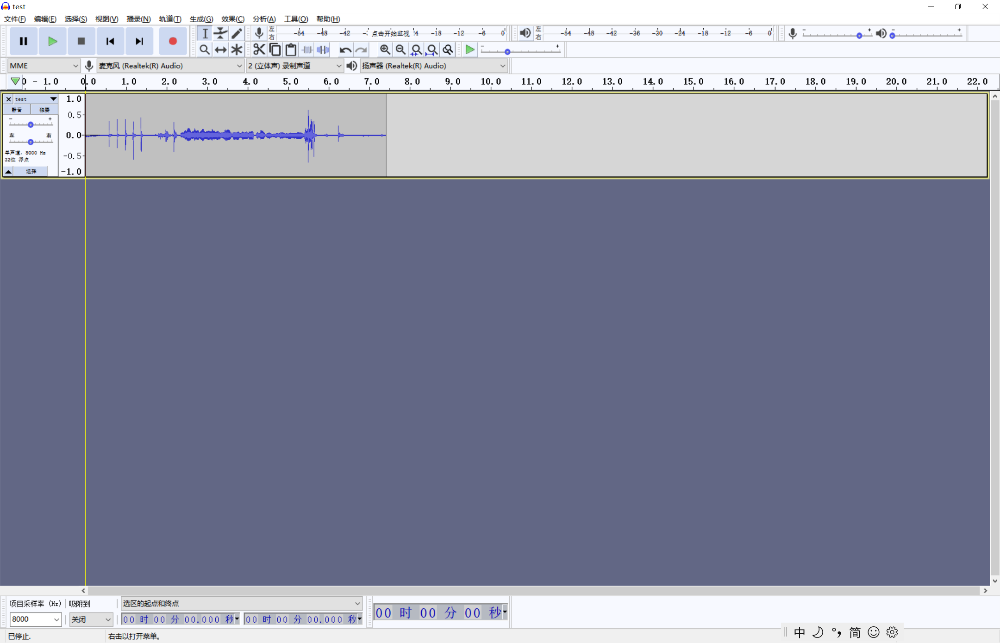
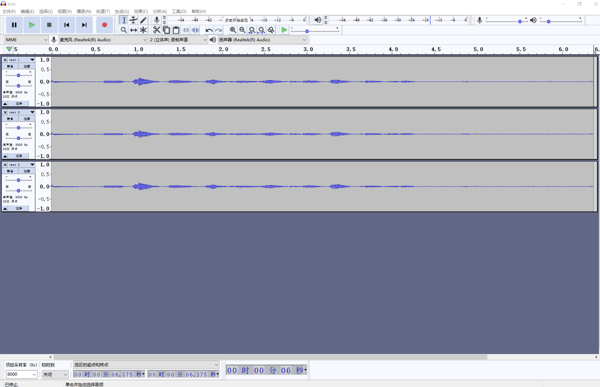

# 录音和播放

R329 EVB5开发板背面贴了3颗麦克风，可组成麦克风阵列，配合降噪算法调试语音识别类产品。



同时接出了SPK L/R，可以接喇叭进行音频相关的调试。



*另需注意图中所示的跳线帽需要接上，否则喇叭播放会不出声音


## 录音

Tina Linux中的音频子系统采用ALSA架构实现。ALSA全称 **Advanced Linux Sound Architecture**，是目前主流的Linux音频体系结构。

ALSA在内核设备驱动层提供了驱动框架alsa-driver，同时在应用层提供了音频接口库alsa-lib，应用程序只要调用alsa-lib提供的API，即可以完成对底层音频硬件的控制。

内置的固件中，已经封装好了音频相关模块，可以直接使用demo录音和播放。


```bash
root@TinaLinux:/# arecord test.wav
[   53.158988] sunxi-codec-machine sndcodec: sunxi_hifi_sndcodec_startup
[   53.166483] sunxi-codec-machine sndcodec: sunxi_hifi_sndcodec_hw_params
[   53.173967] sunxi-internal-cpudai cpudai: ======== hw_params ========
[   53.181212] sunxi-internal-cpudai cpudai: pcm_params->format:2
[   53.187771] sunxi-internal-cpudai cpudai: pcm_params->channels:5
[   53.194529] sunxi-internal-cpudai cpudai: pcm_params->rate:16000
[   53.201281] sunxi-internal-cpudai cpudai: pcm_params->period_size:1024
[   53.208622] sunxi-internal-cpudai cpudai: pcm_params->periods:4
[   53.215276] sunxi-internal-cpudai cpudai: pcm_params->pcm_frames:1024
[   53.222513] sunxi-internal-cpudai cpudai: pcm_params->buffer_size:4096
[   53.229849] sunxi-internal-cpudai cpudai: ===========================
[   53.253756] sunxi-internal-cpudai cpudai: sunxi_hifi_pcm_hw_params
Recording WAVE 'test.wav' : Unsigned 8 bit, Rate 8000 Hz, Mono
^CAborted by signal Interrupt...
[   64.045853] sunxi-internal-cpudai cpudai: sunxi_hifi_pcm_hw_free
arecord: pcm_read:2072: read error: Interrupted system call
[   64.090576] sunxi-codec-machine sndcodec: sunxi_hifi_sndcodec_shutdown
root@TinaLinux:/# ls
44100-mono-s16_le-10s.wav  rdinit
base                       rom
bin                        root
dev                        sbin
etc                        sys
lib                        test.wav
lib64                      tmp
mnt                        usr
overlay                    var
proc                       www
```





## 播放

使用命令*aplay* +音频文件即可播放该文件，如：

```bash
root@TinaLinux:/# aplay test.wav
[  125.270510] sunxi-codec-machine sndcodec: sunxi_hifi_sndcodec_startup
[  125.278025] sunxi-codec-machine sndcodec: sunxi_hifi_sndcodec_hw_params
[  125.285477] sunxi-internal-cpudai cpudai: ======== hw_params ========
[  125.292722] sunxi-internal-cpudai cpudai: pcm_params->format:2
[  125.299283] sunxi-internal-cpudai cpudai: pcm_params->channels:2
[  125.306043] sunxi-internal-cpudai cpudai: pcm_params->rate:48000
[  125.312797] sunxi-internal-cpudai cpudai: pcm_params->period_size:1024
[  125.320138] sunxi-internal-cpudai cpudai: pcm_params->periods:4
[  125.326795] sunxi-internal-cpudai cpudai: pcm_params->pcm_frames:1024
[  125.334034] sunxi-internal-cpudai cpudai: pcm_params->buffer_size:4096
[  125.341369] sunxi-internal-cpudai cpudai: ===========================
[  125.490383] sunxi-internal-cpudai cpudai: sunxi_hifi_pcm_hw_params
Playing WAVE 'test.wav' : Unsigned 8 bit, Rate 8000 Hz, Mono
[  136.190698] sunxi-internal-cpudai cpudai: sunxi_hifi_pcm_hw_free
[  136.370445] sunxi-codec-machine sndcodec: sunxi_hifi_sndcodec_shutdown
```





## 查看音频文件

### 把文件拉到电脑上

我们可以通过adb将音频文件拉到电脑上查看。

```bash
adb pull test.wav
```




### Audacity
查看音频文件可以使用音频处理软件，如*Audacity*。

这是一个常用的音频处理软件，免费，开源，遵循GNU协议，可以到网上搜索下载。Windows和Ubuntu版本均有。



上图就是我们用*Audacity*打开刚刚录下的音频文件的样子。图中只有一个声道，如果是用三麦克风的阵列录得声音，我们可以看到有三个音轨。如果还有一路或者两路回路（AEC），我们一根可以看到四个或者五个音轨。

### 录三个声道
录三个声道可以使用命令：
```bsah
arecord -D hw:audiocodec,0  -f S24_LE -c 3 test.wav
```

”-D：”代表设备，“-f”代表格式（采样深度和大小端），“-c”代表声道数。这里我们录了3个声道，如果3个声道的麦克风都是好的，拉到电脑用Audacity上查看可以看到如图所示的三个音轨：



