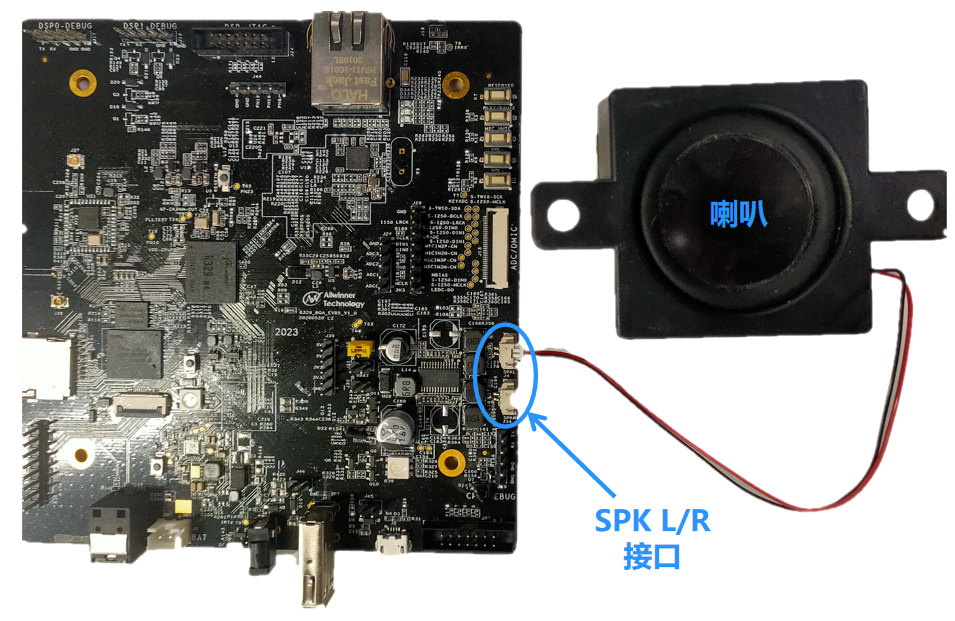

# 录音和播放

R329 EVB5开发板背面贴了3颗麦克风，可组成麦克风阵列，配合降噪算法调试语音识别类产品。

同时接出了SPK L/R，可以接喇叭进行音频相关的调试。

## 录音

Tina Linux中的音频子系统采用ALSA架构实现。ALSA全称 **Advanced Linux Sound Architecture**，是目前主流的Linux音频体系结构。

ALSA在内核设备驱动层提供了alsa-driver，同时在应用层提供了alsa-lib，应用程序只要调用alsa-lib提供的API，即可以完成对底层音频硬件的控制。

内置的固件中，针对Tina Linux 

## 播放

