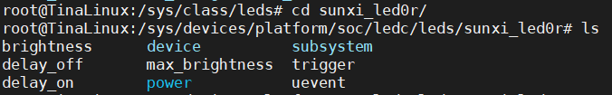
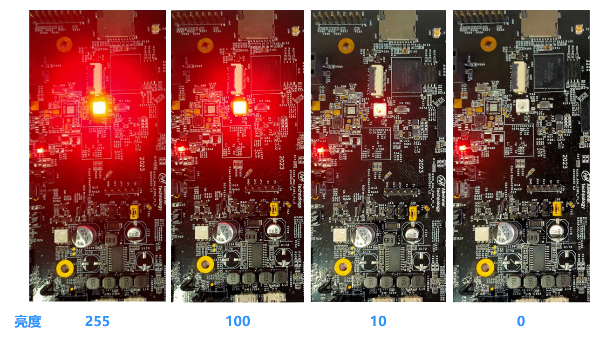
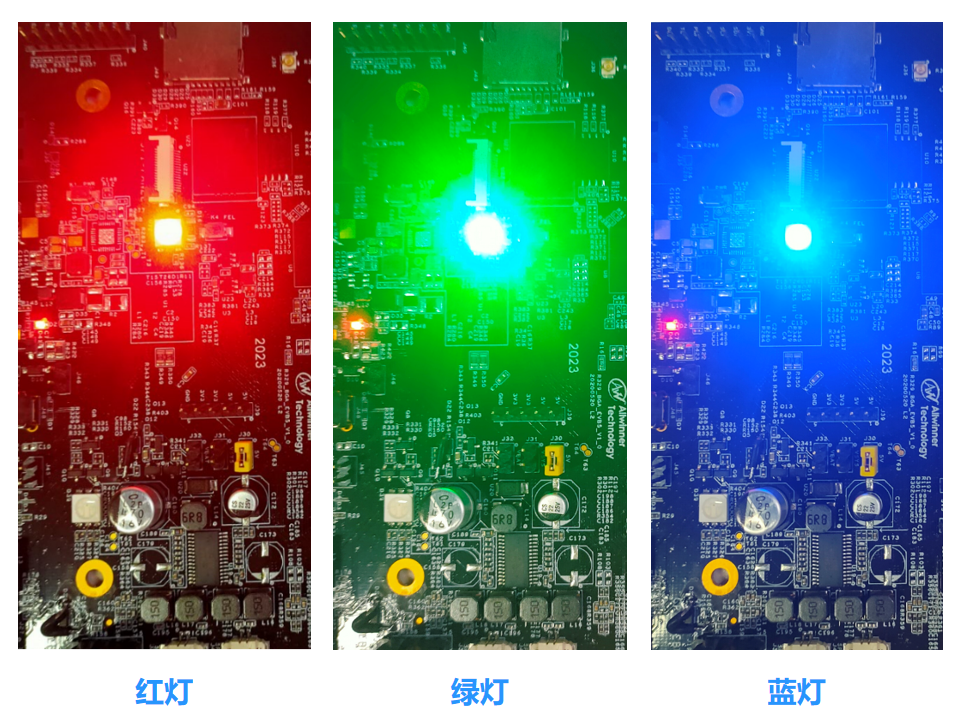

# 点灯

等成功用串口或者ADB连接开发板之后，就可以通过终端命令对开发板进行控制了。

接下来会介绍Tina Linux系统封装几个模块，您可以通过命令启动这几个模块的demo，操控终端几个模块的软硬件。首先是我们大学单片机课程中的必修课：点灯

R329支持LEDC，LEDC全称 **“Light Emitting Diode Controller”**，是借助Linux LED标准子系统实现的LED控制模块，可以对LED灯进行点亮、亮度调节、闪烁、阵列控制等操作。LEDC模块在无屏幕智能音箱上用得很多，比如在等待配对、唤醒、音乐播放等场景，LED灯会以不同的效果表示当前状态。

内置固件已经编译好了LEDC模块，可以直接对LED节点进行控制从而点亮LED灯。

## 进入LED灯路径

首先，我们可以进入LED节点的位置查看一个LED灯三个颜色的节点（R G B）：

```bash
root@TinaLinux:/# cd /sys/class/leds/
root@TinaLinux:/sys/class/leds# ls
sunxi_led0b  sunxi_led0g  sunxi_led0r
```


## 查看LED灯的配置

三个节点分别代三个颜色，我们可以进入一个颜色节点，比如红色（R）：

```bash
root@TinaLinux:/sys/class/leds# cd sunxi_led0r/
root@TinaLinux:/sys/devices/platform/soc/ledc/leds/sunxi_led0r# ls
brightness      device          subsystem
delay_off       max_brightness  trigger
delay_on        power           uevent
```



可以看到LEDC已经做好了很多LEDC的基本操作，包括亮度调节、闪烁、延时等。

## 点亮一个灯

如果我们要点亮其中一个颜色，可以把亮度值写到 **brightness** 里，亮度值最高为255：

```bash
root@TinaLinux:/sys/devices/platform/soc/ledc/leds/sunxi_led0r# echo 255 > brightness
```

此时LED灯会被点亮


## 调节亮度

如果要调节亮度值的话，只需调节写到 **brightness** 的值即可，亮度值范围为0~255，0代表熄灭，255代表最亮：

```bash
root@TinaLinux:/sys/devices/platform/soc/ledc/leds/sunxi_led0r# echo 255 > brightness
root@TinaLinux:/sys/devices/platform/soc/ledc/leds/sunxi_led0r# echo 100 > brightness
root@TinaLinux:/sys/devices/platform/soc/ledc/leds/sunxi_led0r# echo 10 > brightness
root@TinaLinux:/sys/devices/platform/soc/ledc/leds/sunxi_led0r# echo 0 > brightness
```




## 点亮其它颜色的灯

如果要点亮其它颜色的灯 ，只需要参照红灯，将亮度值写到绿灯和蓝灯的 **brightness ** 里即可：

````bash
root@TinaLinux:/sys/class/leds# echo 255 > sunxi_led0g/brightness
root@TinaLinux:/sys/class/leds# echo 0 > sunxi_led0g/brightness
root@TinaLinux:/sys/class/leds# echo 255 > sunxi_led0b/brightness
root@TinaLinux:/sys/class/leds# echo 0 > sunxi_led0b/brightness
````




## 闪烁

如果要实现LED灯闪烁的效果，把 **timer** 写到 **trigger** 即可：

```bash
root@TinaLinux:/sys/class/leds# echo timer > sunxi_led0r/trigger
```


**如果你看到灯亮了，那么恭喜你，它将照亮你嵌入式开发学习的路。**


LED灯阵列操作、模块配置、源码结构、内外部接口等进阶操作请见开发文档《Tina Linux LED开发指南》：[《Tina Linux LED开发指南》下载](http://netstorage.allwinnertech.com:5000/sharing/NMoYOnCrI)

同时，还可以使用三个PWM接口对LED的三色灯进行控制，但需要占用较多的引脚和资源。