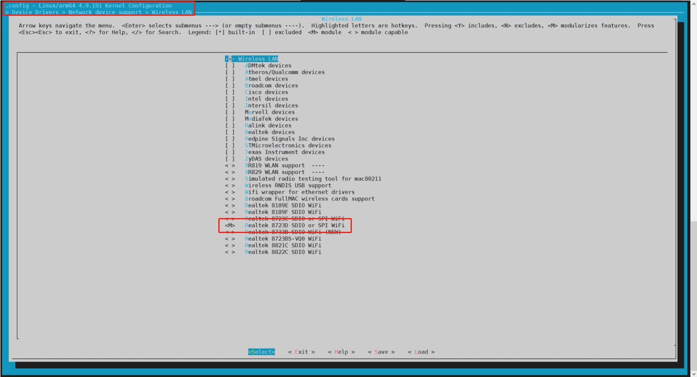

#  修改WiFi/BT模组

本节以修改WiFi/BT模组为例，演示修改替换一个模块的方法。

在部分版本的的R329 Tina中（如全志官方对外release的v0.5版本R329 Tina），EVB5方案配置的Realtek 8723D无线模组。如果我们要替换成全志的XR829无线模组要怎么做呢？大概需要如下几步：


## 修改内核配置

首先，我们先获取环境变量，选好方案：

```bash
source build/envsetup.sh
lunch
```

然后make kernel_menuconfig配置内核：

```bash
make kernel_menuconfig
```

进行无线模组配置选项：

```bash
Device Drivers > Network device support > Wireless LAN
```

可以看到当前选择的模组是Realtek 8723D



*<M>表示编译成模块，可以在启动的时候实用启动脚本加载，<\*>表示编译到内核。

我们将Realtek 8723D反选，并选上XR829：


## 修改Tina配置

```bash
make menuconfig
```

### Firmware

进入*Firmware*目录，反选r8723ds-firmware，并选上xr829-firmware和xr829 with 40M sdd。xr829 with 40M sdd意思是XR829采用40MHz的外挂晶振。

```bash
<*> xr829-firmware..................................... Xradio xr829 firmware                         
[*] xr829 with 40M sdd     
```


### Wireless Driver

进入*Kernel modules > Wireless Driver*，反选*kmod-net-rtl8723ds*，并选上*kmod-net-xr829*和*kmod-net-xrbtlpm*，意思是启动的时候加载xr829模块。


## 重新编译打包烧写固件

```bash
make -j32
pack
```

烧写固件后，使用wifi扫描demo测试，就可以扫描到附近的wifi信号：

```bash
root@TinaLinux:/# wifi_scan_results_test

*********************************
***Start scan!***
*********************************
bssid / frequency / signal level / flags / ssid
64:6e:97:5a:5a:e4       2462    -55     [WPA-EAP-CCMP+TKIP][WPA2-EAP-CCMP+TKIP][ESS]    AWOffice
66:6e:97:1a:5a:e4       2462    -55     [WPA2-PSK-CCMP][ESS]    AWTest
7e:b5:9b:2d:e1:63       2437    -56     [WPA-PSK-CCMP+TKIP][WPA2-PSK-CCMP+TKIP][ESS]    AW-IT-Test
66:6e:97:1b:14:42       2462    -56     [WPA-PSK-CCMP+TKIP][WPA2-PSK-CCMP+TKIP][ESS]    AWTest
7c:b5:9b:fd:e1:bd       2437    -58     [WPA-EAP-CCMP+TKIP][WPA2-EAP-CCMP+TKIP][ESS]    AWOffice
7c:b5:9b:fd:e1:63       2437    -58     [WPA-EAP-CCMP+TKIP][WPA2-EAP-CCMP+TKIP][ESS]    AWOffice
7e:b5:9b:1d:e1:63       2437    -58     [WPA2-PSK-CCMP][ESS]    AWTest
7e:b5:9b:1d:e1:bd       2437    -61     [WPA2-PSK-CCMP][ESS]    AWTest
88:d7:f6:88:8b:c0       2412    -37     [WPA2-PSK-CCMP][WPS][ESS]       AW-PDC-PD4-316Test
90:67:1c:f8:11:ac       2437    -36     [WPA-PSK-CCMP+TKIP][WPA2-PSK-CCMP+TKIP][WPS][ESS]       AW-PDC-RTOS-MUSIC
00:6b:8e:4e:c0:08       2412    -45     [WPA-PSK-CCMP][WPA2-PSK-CCMP][ESS]      AW-PDC-PD4-315test
c8:4c:75:40:86:ff       2452    -54     [WPA-EAP-CCMP+TKIP][WPA2-EAP-CCMP+TKIP-preauth][ESS]    Allwinner
c4:f0:81:63:9d:31       2437    -59     [WPA2-PSK-CCMP][ESS]    \x00\x00\x00\x00\x00\x00\x00\x00\x00\x00\x00\x00\x00\x00\x00\x00\x00\x00\x00\x00\x00\x00\x00\x00\x00\x00\x00\x00\x00\x00\x00\x00
f0:c9:d1:b3:15:49       2412    -55     [WPA-PSK-TKIP][WPA2-PSK-CCMP][ESS]      AP-XRADIO
64:6e:97:5b:14:42       2462    -64     [WPA-EAP-CCMP+TKIP][WPA2-EAP-CCMP+TKIP][ESS]    AWOffice
bc:46:99:d6:62:7c       2462    -60     [WPA-PSK-CCMP][WPA2-PSK-CCMP][ESS]      SochipR3
38:1c:1a:2e:b3:52       2437    -63     [WPA2-PSK-CCMP][ESS]    AWTest
ec:6c:9f:af:89:79       2447    -63     [WPA2-PSK-CCMP][ESS]    AW-APD-GMSipv6
74:a5:28:9a:fc:d4       2432    -65     [WPA-PSK-CCMP+TKIP][WPA2-PSK-CCMP+TKIP][WPS][ESS]       AW-PTD-HK
04:d4:c4:b9:b9:f8       2437    -65     [WPA2-PSK-CCMP][WPS][ESS]       ipv6
ac:e3:42:9c:7f:79       2437    -68     [WPA2-PSK-CCMP][WPS][ESS]
00:1c:a3:14:6a:de       2422    -73     [WPA2-PSK-CCMP][ESS]    AW-PD4-R818
8c:be:be:24:6f:ff       2422    -70     [WPA-PSK-CCMP+TKIP][WPA2-PSK-CCMP+TKIP][WPS][ESS]       AW-PTD-TEST
7e:b5:9b:1d:e1:a3       2462    -75     [WPA2-PSK-CCMP][ESS]    AWTest
80:e8:6f:d9:fd:a1       2412    -73     [WPA-EAP-CCMP][WPA2-EAP-CCMP][ESS]      AWOffice
80:e8:6f:d9:fd:a2       2412    -73     [WPA2-PSK-CCMP][ESS]    AWTest
80:8f:1d:8a:36:76       2452    -60     [WPA-PSK-CCMP][WPA2-PSK-CCMP][ESS]      AW-PDC-PD2-TEST
38:1c:1a:2e:b3:51       2437    -63     [WPA-EAP-CCMP][WPA2-EAP-CCMP][ESS]      AWOffice
b8:55:10:94:90:b4       2427    -74     [WPA-PSK-CCMP][WPA2-PSK-CCMP][WPS][ESS] AW-ANC-TOTOLINK-N600RV2#34
80:e8:6f:d9:5d:62       2412    -75     [WPA2-PSK-CCMP][ESS]    AWTest
80:e8:6f:d9:5d:61       2412    -76     [WPA-EAP-CCMP][WPA2-EAP-CCMP][ESS]      AWOffice
******************************
Wifi get_scan_results: Success!
******************************
```

如果固件的模组不对应，使用wifi相关demo时会提示wifi打开失败：

```bash
root@TinaLinux:/# wifi_scan_results_test
connect wpa_supplicant failed,please check wifi driver!
wifi on failed
```


## 修改蓝牙配置

以上修改只是完成了模组wifi部分，bt部分这时候测试是会打开失败的：

```bash
root@TinaLinux:/# bt_test
root@TinaLinux:/# 58279.055755: [bt_manager_init:212]:  enable default profile from bt config.
58279.055900: [bt_manager_enable:400]:  bt manager version:Version:3.0.1.202012201630,builed time:Dec 29 2020-02:46:30
58279.055915: [bt_test_sta[  144.123489] sunxi-bt soc@03000000:bt: block state already is 1
tus_cb:71]:  bt is turnning on.
[  145.135907] sunxi-bt soc@03000000:bt: set block: 0

58290.178476: [btmg_device_on:56]:  detect hci0......
58293.179028: [btmg_device_on:56]:  detect hci0......
58296.179372: [btmg_device_on:56]:  detect hci0......
^C
root@TinaLinux:/# 58299.179802: [btmg_device_on:56]:  detect hci0......
58302.180339: [btmg_device_on:56]:  detect hci0......
58305.180866: [btmg_device_on:56]:  detect hci0......
58308.181398: [btmg_device_on:61]:  hci0 device available
58308.181471: [bt_test_status_cb:59]:  BT is off
58308.181500: [bt_test_adapter_power_state_cb:43]:  Failed to turn on bt
58308.181530: [bt_manager_enable:436]:  init HCI device failed!
58308.181561: [bt_manager_gap_set_io_capability:1084]:  Bt is off, This should not be called!


(process:1559): GLib-GIO-CRITICAL **: g_dbus_connection_send_message_with_reply_sync: assertion 'G_IS_DBUS_CONNECTION (connection)' failed

(process:1559): GLib-GIO-CRITICAL **: g_dbus_connection_send_message_with_reply_sync: assertion 'G_IS_DBUS_CONNECTION (connection)' failed
```

bt部分还需要修改相关配置文件 **target/allwinner/r329-evb5/base-files/etc/bluetooth/bt_init.sh**

```bash
#!/bin/sh
bt_hciattach="hciattach"

start_hci_attach()
{
        h=`ps | grep "$bt_hciattach" | grep -v grep`
        [ -n "$h" ] && {
                killall "$bt_hciattach"
                sleep 1
        }

        #8723ds h5 init
        echo 0 > /sys/class/rfkill/rfkill0/state;
        sleep 1
        echo 1 > /sys/class/rfkill/rfkill0/state;
        sleep 1

        "$bt_hciattach" -n ttyS1 xradio >/dev/null 2>&1 &
        sleep 1

        wait_hci0_count=0
        while true
        do
                [ -d /sys/class/bluetooth/hci0 ] && break
                sleep 1
                let wait_hci0_count++
                [ $wait_hci0_count -eq 8 ] && {
                        echo "bring up hci0 failed"
                        exit 1
                }
        done
}

start() {

    hcidump_xr=$(ps | grep "hcidump_xr" | grep -v grep | awk '{print $1}')
    if [ -n "$hcidump_xr" ] ;then
        echo "hcidump_xr existed"
    else
        echo "hcidump_xr start"
        hcidump_xr &
    fi

        if [ -d "/sys/class/bluetooth/hci0" ];then
                echo "Bluetooth init has been completed!!"
        else
                start_hci_attach
        fi

    d=`ps | grep bluetoothd | grep -v grep`
        [ -z "$d" ] && {
                /etc/bluetooth/bluetoothd start
                sleep 1
    }
}

ble_start() {
        if [ -d "/sys/class/bluetooth/hci0" ];then
                echo "Bluetooth init has been completed!!"
        else
                start_hci_attach
        fi

        hci_is_up=`hciconfig hci0 | grep RUNNING`
        [ -z "$hci_is_up" ] && {
                hciconfig hci0 up
        }

        MAC_STR=`hciconfig | grep "BD Address" | awk '{print $3}'`
        LE_MAC=${MAC_STR/2/C}
        OLD_LE_MAC_T=`cat /sys/kernel/debug/bluetooth/hci0/random_address`
        OLD_LE_MAC=$(echo $OLD_LE_MAC_T | tr [a-z] [A-Z])
        if [ -n "$LE_MAC" ];then
                if [ "$LE_MAC" != "$OLD_LE_MAC" ];then
                        hciconfig hci0 lerandaddr $LE_MAC
                else
                        echo "the ble random_address has been set."
                fi
        fi
}

stop() {
        echo "nothing to do."
}

case "$1" in
  start|"")
        start
        ;;
  stop)
        stop
        ;;
  ble_start)
            ble_start
                ;;
  *)
        echo "Usage: $0 {start|stop}"
        exit 1
esac
```

R329 EVB5 XR829 bt_init.sh文件下载连接：[bt_init.sh](http://netstorage.allwinnertech.com:5000/sharing/miQeWQ4bj)

make kernel_menuconfig内核配置选上：

```bas
Networking support > Bluetooth subsystem support > Bluetooth device drivers 
<*> Xradio Bluetooth sleep driver support
<*> Xradio Bluetooth farmware debug interface support
[*] Xradio Bluetooth sleep driver support for bluedriod 
```


重新编译打包烧录固件，用BT  demo，成功打开蓝牙会有如下打印：

```bash
root@TinaLinux:/# bt_test
root@TinaLinux:/# 3407.938316: [bt_manager_init:212]:  enable default profile from bt config.
3407.938454: [bt_manager_enable:400]:  bt manager version:Version:3.0.1.202012201630,builed time:Dec 29 2020-02:46:30
3407.938468: [bt_test_status_cb:71]:  bt is turnning on.
hcidump_xr start
Bluetooth init has been completed!!
/etc/bluetooth/bt_init.sh: line 99: hcidump_xr: not found
3408.306362: [bt_profile_global_init:356]:  start bluealsa :1 times
3408.845050: [bt_test_adapter_power_state_cb:41]:  Turn on bt successfully
3409.308667: [bt_test_status_cb:61]:  BT is ON
[   66.468094] [BH_WRN] miss interrupt!
```

以上，一个无线模组就修改好了。

*rtl8723ds和XR829模组是pin to pin的，所以无需修改引脚配置。

