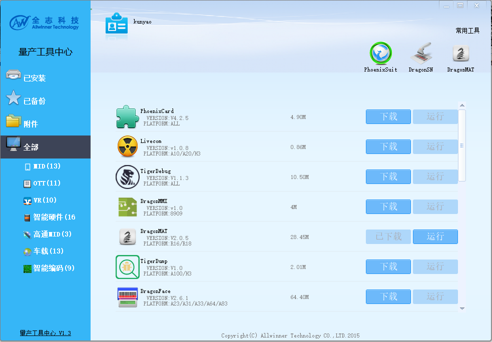

# 生产工具

##量产工具中心APST
全志量产工具中心是全志量产工具下载的平台，您可以在上面下载x到大量产品实际研发、测试、生产中需要用到的工具。如：固件烧写工具PhoenixSuit、SN号烧写工具DragonSN、硬件检测工具DragonHD等。  

下载地址：<http://onlinedoc.allwinnertech.com/f/5fd3cc0533b44f458fca/?dl=1>

##USB烧写驱动

在使用全志固件烧写驱动之前，您需要先安装全志USB烧写驱动。在安装全志量产工具中心APST的过程中，会自动安装该驱动，如果您没有安装量产工具中心APST或者遇到异常，可单独安装全志USB烧写驱动。

下载地址：http://onlinedoc.allwinnertech.com/f/ec4cbdf6c0c6429b8606/?dl=1

##固件烧写工具PhoenixSuit

PhoenixSuit是全志固件烧写工具，可以将上位机编译好的固件（.img）烧写（下载）到开发板上。    

下载地址：<http://onlinedoc.allwinnertech.com/f/eca95326100f42598e86/?dl=1>

##设备号烧写工具DragonSN

DragonSN是全志设备号烧写工具，可以通过USB将设备号（SN）、MAC地址、安全密钥等烧写到开发板的某个分区。

下载地址：<http://onlinedoc.allwinnertech.com/f/f075e88565b44e7aac8d/?dl=1>   

