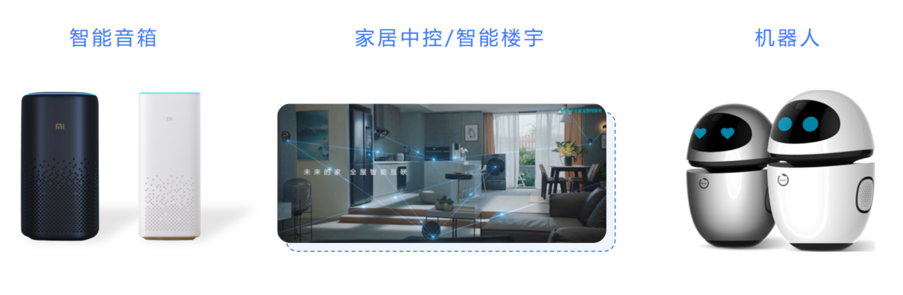

# R329简介

R329是全志科技针对智能语音旗舰市场推出的一款高集成度SoC，搭载双核A53 1.5G CPU，内置双核400MHz HiFi4 和 800MHz AIPU 0.25TOPS，可以满足各种智能语音产品的需求

##应用场景

## 核心规格

处理器：双核A53 1.5GHz，NPU 0.25T  

内置DDR3 128MB/256M  
（如果您手中的R329芯片丝印型号为R329-N3，即为内置128M DDR；如果是R329-N4，即为内置256M DDR）    

双核HIFI4 400MHz，2MB SRAM   
音频：5路ADC，2路DAC  
接口：I2S*3/DMIC/OWA，USB*2.0\*2，GMAC   
显示：SPI LCD, PWM*15   
工艺：HPC28+   
封装：12mm×12mm  
系统：全志智能硬件深度定制Tina Linux  

##标案开发板

为方便开发者开发、调试及评估芯片性能，全志提供了官方开发板R329_evb5

开发板介绍见:  [R329 EVB5开发板介绍](https://r329.readthedocs.io/zh_CN/latest/r329_evb5/)

