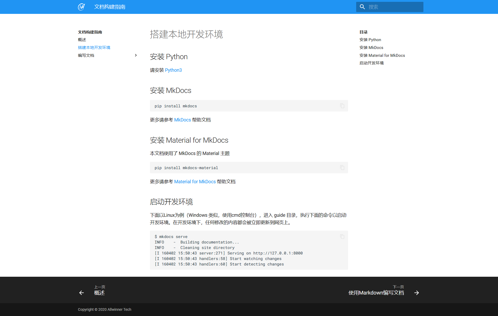

# 搭建本地开发环境


## 安装 Python

请安装 [Python3](https://www.python.org/downloads/)


## 安装 MkDocs

```
pip install mkdocs
```

更多请参考 [MkDocs](https://www.mkdocs.org/#installation) 帮助文档


## 安装 Material for MkDocs

本文档使用了 MkDocs 的 Material 主题

```
pip install mkdocs-material
```

更多请参考 [Material for MkDocs](https://squidfunk.github.io/mkdocs-material/getting-started/) 帮助文档


## 启动开发环境

下面以Linux为例（Windows 类似，使用cmd控制台），进入 guide 目录，执行下面的命令以启动开发环境。

```
$ mkdocs serve
INFO    -  Building documentation...
INFO    -  Cleaning site directory
[I 160402 15:50:43 server:271] Serving on http://127.0.0.1:8000
[I 160402 15:50:43 handlers:58] Start watching changes
[I 160402 15:50:43 handlers:60] Start detecting changes
```

打开浏览器，访问 http://127.0.0.1:8000 查看效果。在开发环境下，任何修改都会被立即更新到网页上。

