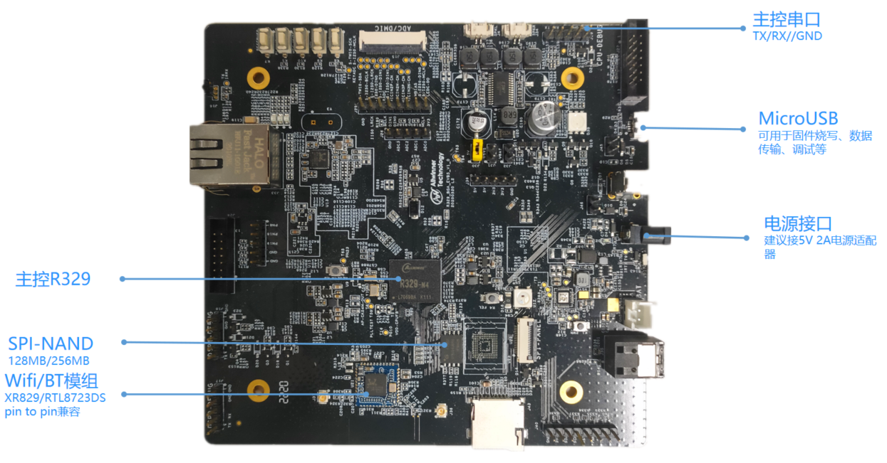
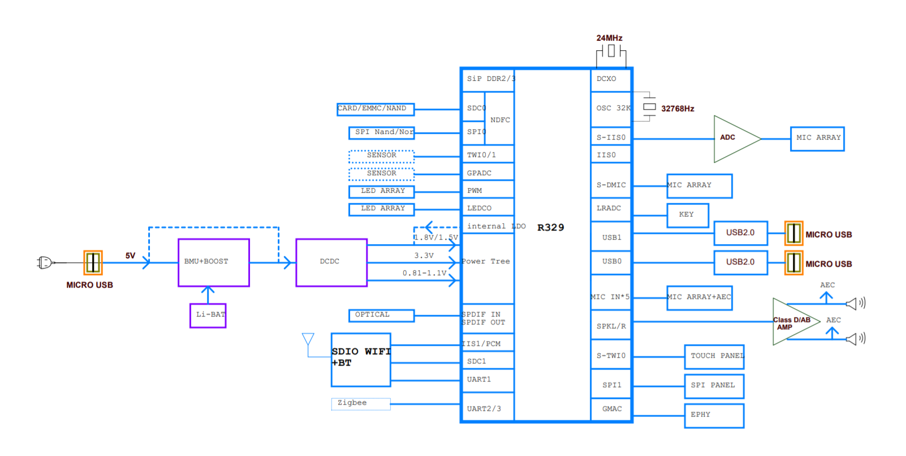

# 开发板介绍
R329-EVB5开发板是基于全志R329芯片的全功能基础开发板，引出了R329几乎所有功能引脚，主要用于内部研发调试、开发者学习、方案评估、项目预研、产品功能预开发等。

## 开发板简介

主控：R329（BGA封装）

PCB板层数：2层

PCB板框大小：120mm*126mm

供电：5V-2A适配器，可外接锂电池

建议调试方式：UART串口，USB-ADB（TinaLinux系统内置adb调试功能）

DDR：128MB/256MB ，sip于主控中，其中芯片丝印为R329-N3的芯片sip的DDR为128MB，芯片丝印为R329-N3的芯片sip的DDR为256MB

存储：128MB spi-nand

***网络***

无线模组：XR829或RTL8723DS，均支持2.4G wifi和BT，两款模组可以pin to pin兼容

ETH：千兆网口

***音视频***

音频：3.5mm耳机口；spdif in/out；三角形硅mic阵列，贴于背面；板载排线槽可接最多8路麦克风阵列；SPK L/R

视频：板载排线槽可接SPI屏幕，可支持触控

SD卡：板载SD卡卡槽，最高支持128G SD卡

其它：PWM LED\*1；LEDCO LED\*1；LRADC KEY\*5；microUSB\*1；DSP debug调试口*2；

开发板原理图：

